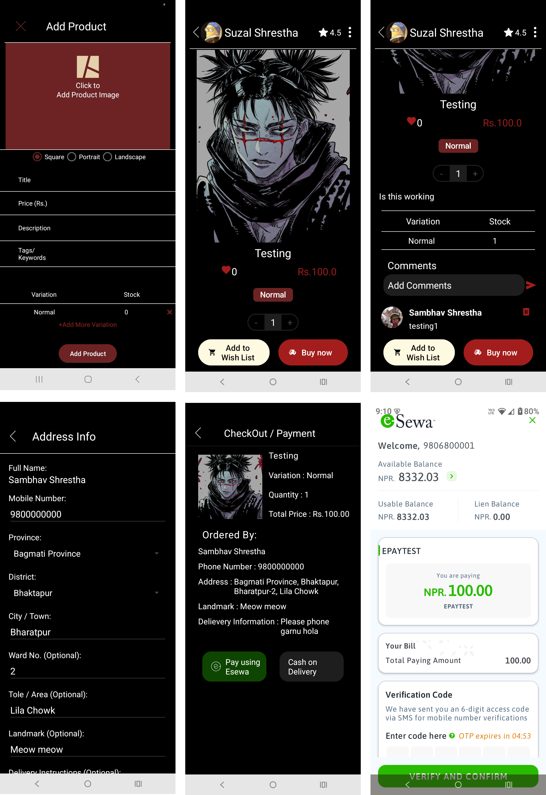
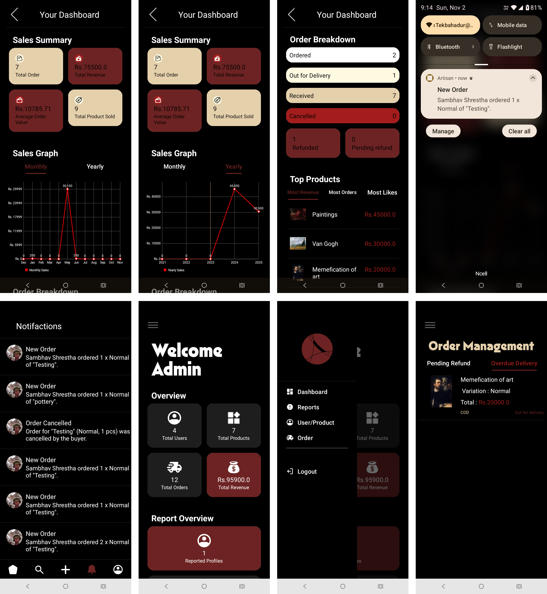

# Artisan Android Application

An Android app for buying and selling handmade products, connecting artisans and customers through a modern, user-friendly platform.

## 🚀 Features
- Seller dashboard with revenue & order stats  
- Smart recommendations using content-based filtering  
- eSewa payment integration  
- Real-time notifications (FCM)  
- Product & profile search with sorting and filtering  

---

## 🛠️ Tech Stack
**Language:** Java  
**Backend & Authentication:** Firebase Firestore, Firebase Auth, Cloudinary  
**Notifications:** Firebase Cloud Messaging (FCM)  
**IDE:** Android Studio  
**Version Control:** Git + GitHub  

---

## 🖼️ Screenshots

### Home & Profile

### Product & Checkout

### Seller Dashboard

---

